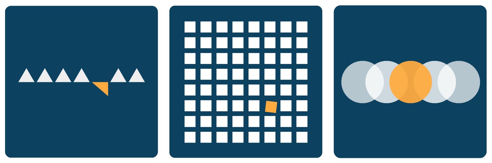

# YGEIA



## Dashboard
🚧 Under Construction 🚧

**Note:** For security and data privacy reasons, specific files or directories containing sensitive information have been omitted from the repository. Consequently, the backend functionality will not be operational, and only the frontend will be visible. However, graphical elements may be absent. Please be aware that this limitation is intentional to safeguard data privacy.


## Installation and Usage

This is a [Next.js](https://nextjs.org/) project bootstrapped with [`create-next-app`](https://github.com/vercel/next.js/tree/canary/packages/create-next-app).

### Prerequisites

Ensure you have the following installed on your system:
- **Node.js** (version 14.x or higher)
- **npm** (version 6.x or higher) or **yarn** (version 1.x or higher)

### Steps
1. **Clone the Repository**
   ```bash
   git clone https://github.com/your-username/YGEIA.git
   cd YGEIA
   ```

2. **Install Dependencies**

   Using npm:
   ```bash
   npm install
   ```

   or using yarn:
   ```bash
   yarn install
   ```

3. **Run the Aplication**
   
    Using npm:
    ```bash
    npm run dev
    ```


    or using yarn:
    ```bash
    yarn dev
    ```

This will start the development server, and you can view the application in your browser at http://localhost:3000.


## Learn More

To learn more about Next.js, take a look at the following resources:

- [Next.js Documentation](https://nextjs.org/docs) - learn about Next.js features and API.
- [Learn Next.js](https://nextjs.org/learn) - an interactive Next.js tutorial.

You can check out [the Next.js GitHub repository](https://github.com/vercel/next.js/) 
